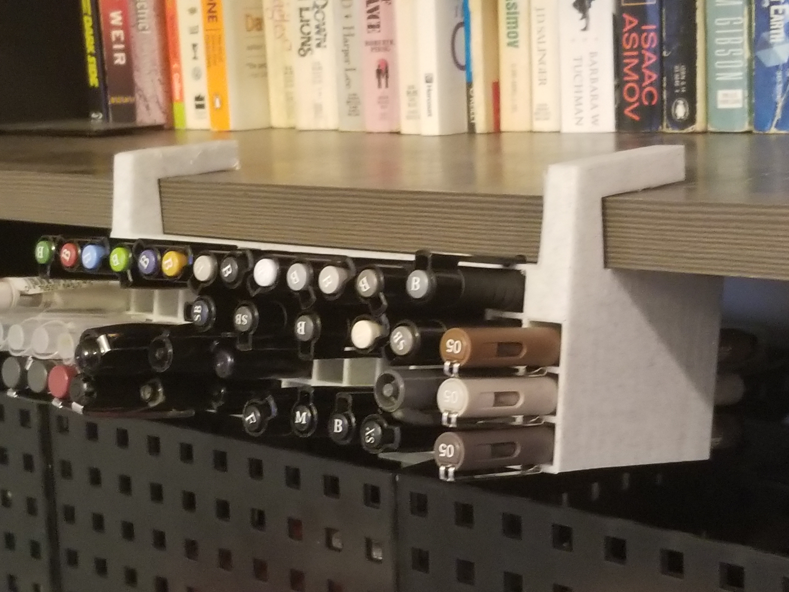
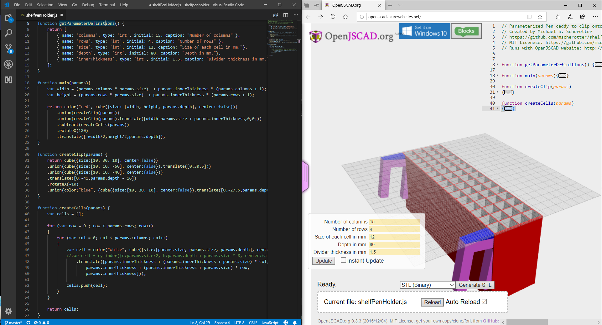
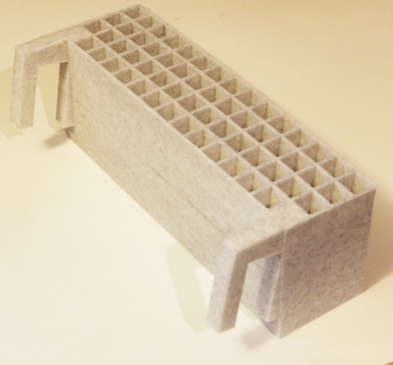

# Shelf Hanging Pen Holder
An parametric-defined adjustable pen holder that hangs from 2cm high shelves from [the Container Store](https://www.containerstore.com/s/driftwood-melamine-shelves/d?productId=10018499).

## Parameters
- Columns: number of horizontal cels
- Rows: number of vertical cels
- Size: the size in mm of each cell square
- Depth: the depth in mm of the cells 
- Inner Thickness: the thickness of the spacing between each cell

## Building the Model
This is the most productive workflow that I've found for developing OpenJSCAD-based models:
 
1. Open the site [OpenJSCAD](http://openjscad.azurewebsites.net) in a web browser
2. From the OS file explorer drag the file [shelfPenHolder.js](shelfPenHolder.js) to the box on the bottom of the page where it says "Drop your jscad...."
3. Check the Auto Reload checkbox
4. Open the [shelfPenHolder.js](shelfPenHolder.js) in Visual Studio Code
5. Modify the parameters to fit your needs
6. Press the Generate STL button to download the STL file that you can print from a 3D Printer

Here is a [model](shelfPenHolder.stl) generated from the default parameters.  The model can be printed by most printers without supports.

